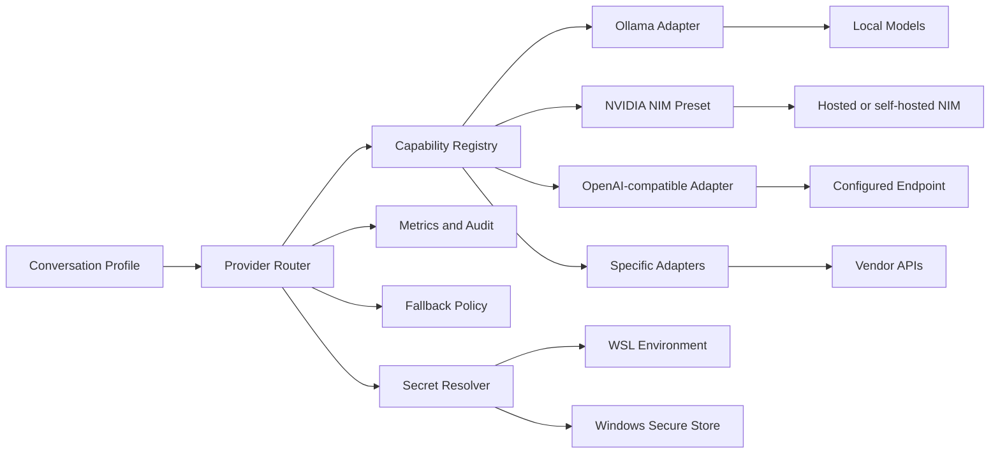

# Arquitetura futura do AI Provider Hub



## Separação de responsabilidades

### Provider registry

Mantém descritores, capacidades, estado e configuração não secreta.

### Secret resolver

Resolve `secretRef` somente no momento da chamada. O valor nunca volta para o registro nem para a interface.

### Router

Escolhe provedor/modelo conforme tarefa, perfil, política e estado do circuito.

### Adapter

Converte o contrato interno no protocolo do provedor.

### Telemetria

Registra latência, resultado, modelo, tokens e erro categorizado. Não registra prompts completos por padrão nem dados de autenticação.

## Exemplo de rota

```yaml
routes:
  live-answer:
    primary: nvidia-fast
    fallbacks: [ollama-local]
  final-summary:
    primary: cloud-quality
  embeddings:
    primary: ollama-embedding
```
