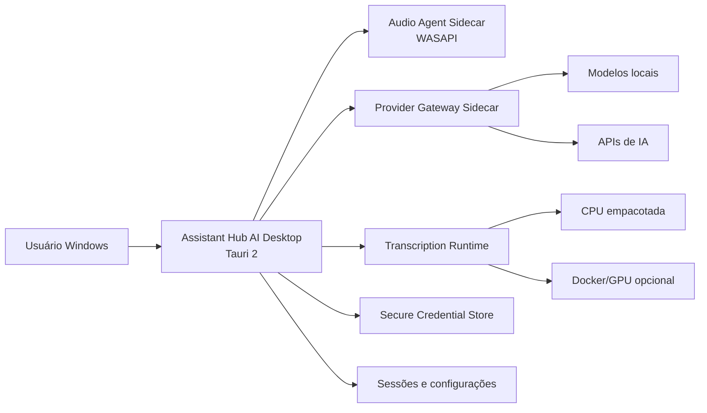

# Arquitetura futura de distribuição desktop



## Princípios

- o shell não implementa regras de domínio;
- sidecars têm health check e encerramento coordenado;
- segredos ficam fora dos arquivos de configuração;
- WSL permanece ambiente de desenvolvimento, não requisito universal do produto;
- modelos grandes são baixados sob demanda, nunca embutidos no instalador;
- o instalador deve ser pequeno e explicar dependências opcionais.

## Diretórios futuros

```text
apps/desktop-shell/
packages/provider-sdk-java/
services/provider-gateway/
packaging/windows/
```
